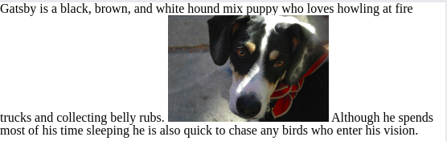
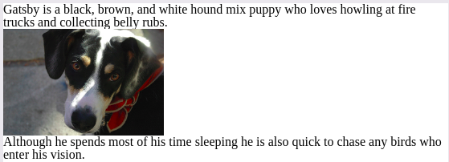
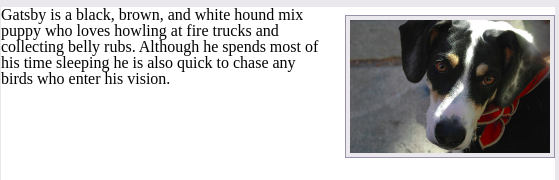

# ADICIONANDO MÍDIAS

## IMAGENS

Para adicionar imagens na página, utilizamos o elemento inline **.**

O elemento **img** é um elemento self-containing, ou vazio: não envolve outro elemento e existe como uma tag única.

Devemos acrescentar uma source com o atributo *src* o qual referencia como valor o path ou caminho até a imagem desejada.

Em conjunto com o atributo src, utilizamos o atributo *alt* (alternative text), que descreve o conteúdo da imagem. O atributo *alt* é utilizado por mecanismos de busca e tecnologias de assistência de acessibilidade. O texto alternativo será disponível caso a imagem, por alguma razão, não aparece disponível.

```html

```

### SIZING IMAGES

Existem varios tipos de maneiras para apresentar o tamanho de uma imagem de formar a rendenizá-la.

```css
img {
  height: 200px;
  width: 200px;
}
```

Utilizar desta maneira a propriedade, força  a imagem a se tornar aquele tamanho, o que pode distorcer a imagem. Podemos ainda definir apenas uma propriedade, fazendo com que haja um cálculo para encontrar qual o novo tamanho.

Podemos ainda definir por porcentagem para que quando diminua o tamanho da janela do navegador a imagem seja quebrada.

### POSICIONANDO IMAGENS

Utilizando CSS, podemos alterar o posicionamento da imagem, que por padrão vem inline.

Utilizamos então *flat, display* e as propriedades de box model, como *padding, border e margin.*

- ***inline positioning***

```html
<p>Gatsby is a black, brown, and white hound mix puppy who loves howling at fire trucks and 
collecting belly rubs.  
Although he spends most of his time sleeping he is also quick to chase any birds who enter his vision.</p>
```



- ***block positioning***

```css
img {
  display: block;
}
```



- ***positioning images flush left or right***

Utilizando a popriedade float com os valores left ou right

```css
img {
  background: #eaeaed;
  border: 1px solid #9799a7;
  float: right;
  margin: 8px 0 0 20px;
  padding: 4px;
}
```



### IMAGE ELEMENT vs BACKGROUND IMAGE

O elemento  em HTML é a opção preferida quando imagens carregam valores semanticos, muito importantes na construção de sites HTML.

Já as propriedades background ou background-images são opções válidas quando as imagens utilizadas possuem valor de design ou de interface de usuário da página, não sendo diretamente relacionadas ao conteúdo da página.

## ÁUDIO

Para adicionar áudios em uma página HTML basta acrescentar o elemento **<audio>.**

O elemento <audio> aceita como atributo a source do arquivo que contem o áudio desejado.

```html
<audio src="jazz.ogg"></audio>
```

### AUDIO ATTRIBUTES

Vários outros atributos podem acompanhar o elemento <audio>, sendo os mais comuns: autoplay, controls, loop, and preload.

Os atributos autoplay, controls e loop são atributos boleanos, não sendo necessário utilizar valores atribuidos à eles.

Por padrão, o elemento <audio> não aparece na página.

- *autoplay*

O atributo autoplay permite a reprodução automática do audio assim que a página é carregada

```html
<audio src="jazz.ogg" autoplay></audio>
```

- *controls*

O atributo controls permite para apresentar o áudio na página, permitindo também que o usuário realize o controle do áudio, como pausa, volume e  busca.

```html
<audio src="jazz.ogg" controls></audio>
```

- *loop*

O atributo loop faz com que o áudio se repita continuamente.

```html
<audio src="jazz.ogg" loop></audio>
```

- *preload*

O atributo preload permite identificar qual informação sobre o audio deve ser carregada antes do clip ser iniciado. Aceita 3 valores: none, auto e metadata.

### AUDIO FALLBACKS & MULTIPLE SOURCES

Podemos acrescentar várias sources para uma mesmo áudio, diminuindo a chance de um áudio não ser disponibilizado.

Assim que o browser identifica um audio disponível ele irá carrega-lo e ignora as outras fontes de áudio.

```html
<audio controls>
  <source src="jazz.ogg" type="audio/ogg">
  <source src="jazz.mp3" type="audio/mpeg">
  <source src="jazz.wav" type="audio/wav">
  Please <a href="jazz.mp3" download>download</a> the audio file.
</audio>
```

## VIDEO

Por fim, podemos adicionar vídeos em HTML5, sendo bem semelhante a forma que adicionamos áudio.

Utilizamos o elemento **<video\>,** e podemos utilizar os mesmos atributos: src, autoplay, controls, loop, and preload.

Além disso, fallback e multiple sources, comentado no último tópico de audios pode ser aplicado para os videos.

```html
<video src="earth.ogv" controls></video>
```

Como videos costumam ser maiores, é uma boa prática definir as propriedades *width* e *height* no CSS, assegurando que o vídeo não seja tão grande e esteja no layout da página. **

- *poster attribute*

Um atributo adicional para o elemento <video\> é o atributo poster.

Permite atribuir uma imagem específica na forma de URL para aparecer antes do vídeo ser iniciado.

```html
<video src="earth.ogv" controls poster="earth-video-screenshot.jpg"></video>
```

### VIDEO FALLBACK

```html
<video controls>
  <source src="earth.ogv" type="video/ogg">
  <source src="earth.mp4" type="video/mp4">
  Please <a href="earth.mp4" download>download</a> the video.
</video>
```

## INLINE FRAMES

Uma outra forma de adicionar conteúdo a uma página HTML é embedd (embutir) uma outra página HTML dentro da página atual.

Isto é feito utilizando uma inline frame, ou o elemento **<iframe\>.**

O elemento <iframe\> aceita o link URL ou source padrão de outra página HTML com o atributo *src.*

Isso causa com que o conteúdo da página que está sendo embutida será disponível na página atual.

```html
<iframe src="https://www.google.com/maps/embed?..."></iframe>
```

Muitas páginas utilizam o iframe para acrescentar mídias na página a partir de um website externo como Google Maps, YouTube, entre outros.

O elemento <iframe\> possui alguns estilos próprios por padrão, como *border, width e height.* Todos estes podem ser alterados utilizando no próprio HTML, alterando as atributos: *frameborder, width e height. Ou ainda, alterando em um CSS as propriedades: border, width e height.*

## SEMANTICALLY IDENTIFYING FIGURES & CAPTIONS

Com HTML5 também ocorreu a introdução aos elementos **<figure\>** e **<figcaption\>.**

Estes elementos foram criados para marcar semanticamente conteúdos midiáticos.

### FIGURE

O elemento block-level **<figure\>** é utilizado para identificar e envolver conteúdos self-contained na forma de mídia.

Envolve imagens, audios e clips, videos, blocos de códigos, diagramas, ilustrações, entre outros.

Pode envolver uma ou várias mídias ao mesmo tempo.

```html
<figure>
  
</figure>
```

### FIGURE CAPTION

Para adicionar uma legenda para o elemento **<figure\>**, utilizamos o elemento **<figurecaption\>.**

Pode aparecer acima, abaixo ou qualquer lugar relativo ao <figure\>, sendo apenas apresentado uma vez.

É utilizado para a descrição de todos elementos constitutívos do elemento <figure\>.

Alternativamente, <figcaption\> pode substituir o atributo <alt\> presente no elemento , caso o elemento <figcaption\> providencia uma descrição útil para o conteúdo visual que constitui a imagem.

```html
<figure>
  
  <figcaption>A beautiful black, brown, and white hound dog wearing kerchief.</figcaption>
</figure>
```