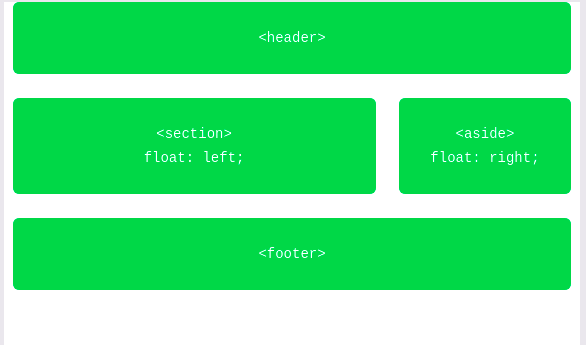
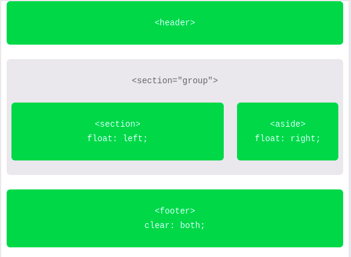

# BOX MODEL & POSICIONAMENTO

# BOX MODEL

Na construção de uma página web, devemos nos atentar à formação de blocos ou elementos in-line.

Blocos são utilizados com proposito geral de cabeçalhos, tabelas, juntando um conteúdo principal em um mesmo bloco semântico. Já elementos in-line são como pequenos fragmentos em negrito, itálico, dentro de alguma frase ou parágrafo, sem propósito de união de conteúdo e / ou semântico.

A propriedade já vem por padrão no CSS, porém, é possível alterá-la com a propriedade display.

```css
p {
	display = block;
}
```

Temos: block, inline, inline-block e none.

O valor none esconde o elemento ou objeto a qual foi atribuída este valor.

### BOX MODEL:

Todo elemento em uma página é uma caixa retangular.

Cada parte do modelo de caixa corresponde a uma propriedade CSS: width (largura), height (altura), padding, border e margin.

```css
div {
  border: 6px solid #949599; // <grossura> <padrão> <cor da borda>
  height: 100px;            
  margin: 20px;
  padding: 20px;
  width: 400px;
}
```

A largura total de um box model pode ser calculado por:

margin-right + border-right + padding-right + width + padding-left + border-left + margin-left

Enquanto isso, a altura total de um box model pode ser calculado por:

margin-top + border-top + padding-top + height + padding-bottom + border-bottom + margin-bottom


- Height: 192px = 20px + 6px + 20px + 100px + 20px + 6px + 20px
- Width: 492px = 20px + 6px + 20px + 400px + 20px + 6px + 20px

### Margin no CSS

```css
div {
	margin : 10px; // 10px em todas as direções
	margin : 10px 5px 2px 0px; // top, right, bottom, left
}
```

Podemos ainda especificar cada uma das margens:

```css
div {
	margin-top : 10px;
	margin-bottom : 2px;
	...
}
```

# POSICIONANDO ELEMENTOS

### FLOAT PROPERTY

A princípio, a propriedade float permite retirar um elemento de sua posição inicial e colocá-lo à direita ou a esquerda de seu elemento pai (em posição de hierarquia logo acima).

Todos os outros elementos dispersarão ao redor deste elemento em float.

```css
img {
  float: left;
}
```

Inicialmente possuimos uma estrutura pelo código à esquerda, mas alterando as propriedades do estilo, podemos redefinir a arquitetura e obter uma nova configuração.

**ANTES**

```html
<header>...</header>
<section>...</section>
<aside>...</aside>
<footer>...</footer>
```


**DEPOIS**

```css
section {
  float: left;
  margin: 0 1.5%;
  width: 63%;
}
aside {
  float: right;
  margin: 0 1.5%;
  width: 30%;
}
```



**CLEAR FLOAT**

Quando criamos  uma página com blocos em estado de float, podemos sem querer alterar os estados de outras divisões.

Para corrigir, utilizamos a seguinte linha no estilo do objeto que queremos consertar:

```css
div {
	clear : <lado em que será "limpado" o float> 
}
```

Os valores comuns são both, left e right.

**CONTAINING**

Outra forma de ajeitar o objeto, é por meio do contein, agrupando os objetos em float.

```html
<header>...</header>
<div class="group">
  <section>...</section>
  <aside>...</aside>
</div>
<footer>...</footer>
```

```css
.group:before,
.group:after {
  content: "";
  display: table;
}
.group:after {
  clear: both;
}
.group {
  clear: both;
  *zoom: 1;
}
section {
  float: left;
  margin: 0 1.5%;
  width: 63%;
}
aside {
  float: right;
  margin: 0 1.5%;
  width: 30%;
}
```



### ALTERANDO A POSIÇÃO DE UM ELEMENTO INDIVIDUALMENTE

Quando alteramos a propriedade de float de um elemento, podemos ocasionar a movimentação de outros elementos da página.

Para isso, utilizamos o atributo **position**, que por padrão é estático para os elementos, mas pode ter seu valor alterado para: *relative* e *absolute.*

*RELATIVE:* altera de acordo com a posição inicial do objeto, relativa.

*ABSOLUTE:* posição absoluta em realação ao objeto parental (normalmente body)