# FORMS

```
<textarea name="comment">Add your comment here</textarea>
```

> [http://diveinto.html5doctor.com/forms.html](http://diveinto.html5doctor.com/forms.html)

Formulários constituem a requisição e captura de informações do usuário, sendo processados de maneira desejada, muitas vezes pelo backend da aplicação. 

## INICIALIZANDO UM FORMULÁRIO

Para adicionar um formulário à página, adicionamos o elemento **< form >**. 

```html
<form action="/login" method="post">
  ...
</form>
```

Vários atributos podem ser adicionados ao elemento <form\>, sendo os mais comuns: ***action*** e ***method***.

***action***

O atributo action contém a URL para onde a informação incluída no formulário será enviada para ser processada pelo servidor.

***method***

O atributo método corresponde ao método HTTP que os navegadores devem utilizar para submeter os dados do formulário.

## TEXT FIELD & TEXTAREAS

***TEXT FIELDS***

Um dos principais elementos utilizados para obter textos dos usuários são os elementos ***< input >***.

O elemento input possui o atributo ***type*** para definir qual o tipo de informação que será capturado.

O valor mais padrão para o atributo type do elemento input é ***text,*** denotando uma única linha de texto a ser dada como input.

Como boa prática de programação, é ideal adicionar um atributo ***name*** para o elemento input.

```html
<input type="text" name="username">
```

Aqui temos alguns valores para o atributo *type* do elemento *input* que correspondem à campos de texto.

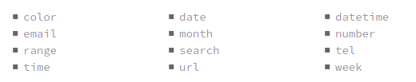

```html
<input type="date" name="birthday">
<input type="time" name="game-time">
<input type="email" name="email-address">
<input type="url" name="website">
<input type="number" name="cost">
<input type="tel" name="phone-number">
```

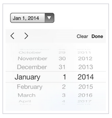

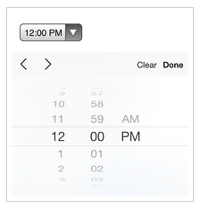

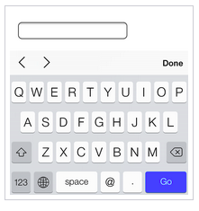

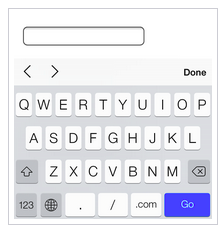

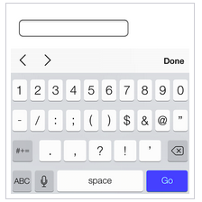

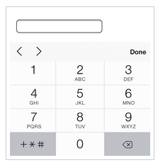

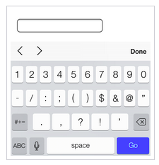

***TEXTAREA***

Outro elemento utilizado para capturar text-based data é o elemento ***< textarea >***

Diferentemente do input, textarea aceita maiores passagens de texto, expandindo para mais linhas /  colunas a possibilidade de escrita.

```html
<textarea name="comment">Add your comment here</textarea>
```

Elementos textarea possuem dois atributos de tamanho: cols, determinando a largura da caixa de texto, e rows, determinando o número de linhas da caixa. Entretanto, o tamanho da área de texto, normalmente, é alterada utilizando propriedade *width* e *height* na estilização com CSS.

## MULTIPLE CHOICE INPUTS & MENUS

***RADIO BUTTONS***

Radio buttons são faceis para permitir que o usuário faça escolhas em uma pequena lista de opções.

Permitem a seleção de apenas uma escolha, em oposição à multiplas opções.

Para criar um radio button, basta criar um elemento <input\> com o atributo *type* com valor de ***radio***. 

Todos elementos radio button devem ter o mesmo atributo ***name*** igual, para que sejam agrupados corretamente em um grupo do formulário.

```html
<input type="radio" name="day" value="Friday" checked> Friday
<input type="radio" name="day" value="Saturday"> Saturday
<input type="radio" name="day" value="Sunday"> Sunday
```

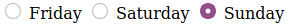

***CHECK BOXES***

Muito semelhantes à radio buttons.

Utiliza o mesmo atributo e padrões que radio buttons, com a exceção do ***type*** com valor de *checkbox.*

A diferença entre checkbox e radio, é que checkbox permitem a seleção de multiplos valores ou opções, enquanto radio limita o usuário a escolha de apenas um valor.

```html
<input type="checkbox" name="day" value="Friday" checked> Friday
<input type="checkbox" name="day" value="Saturday"> Saturday
<input type="checkbox" name="day" value="Sunday"> Sunday
```

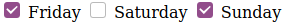

***DROP-DOWN LISTS***

Providencia ao usuário uma longa lista de opções, sendo muito bons para uma seleção de uma opção em uma longa lista de escolhas possíveis.

Para criar uma drop-down list, utilizamos os elementos ***< select >*** e ***< option >***. O primeiro envolve o segundo.

```html
<select name="day">
  <option value="Friday" selected>Friday</option>
  <option value="Saturday">Saturday</option>
  <option value="Sunday">Sunday</option>
</select>
```

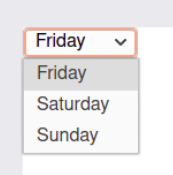

***Multiple Selection***

O atributo boleano *multiple*, quando adicionado ao elemento <select\> para uma lista drop-down padrão, permite com que o usuário realize a escolha de várias opções de uma lista de uma vez.

Ainda, adicionado o atributo boleano *selected* ao elemento <option\> apresentara esta específica opção selecionada por padrão.

```html
<select name="day" multiple>
  <option value="Friday" selected>Friday</option>
  <option value="Saturday">Saturday</option>
  <option value="Sunday">Sunday</option>
</select>
```

obs: é necessário segurar *shift* para selecionar vários elementos ao mesmo tempo

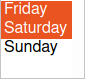

## FORM BUTTONS

Após o usuário colocar a informação requisitada, form buttons permitem que o usuário inicie o envio dos dados.

Comumente, submit botton e submit input são usados para processar os dados.

***SUBMIT INPUT***

Criado a partir de um elemento <input\>, com o atributo *type* com valor ***submit***.

```html
<input type="submit" name="submit" value="Send">
```

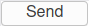

***SUBMIT BUTTON***

Podemos ainda utilizar o elemento <button\>, permitindo uma maior flexibilidade, dependendo do momento, para a estilização, entre outros.

Por padrão, elementos <button\> agem como se tivessem o atributo *type* como submit, não sendo necessário escrevê-lo.

```html
<button name="submit">
  <strong>Send Us</strong> a Message
</button>
```

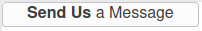

### OUTROS INPUTS

***HIDDEN INPUT***

Possibilidade de passar dados para o servidor sem disponibilizar para os usuários.

Basta criar um input com o valor de *type* igual à *hidden*

```html
<input type="hidden" name="tracking-code" value="abc-123">
```

***FILE INPUT***

Para permitir que usuários enviem arquivos no formulário, como linkar arquivos ao email, etc.

Basta criar um input com o atributo type com valor file.

```html
<input type="file" name="file_input">
```


## ORGANIZING FORM ELEMENTS

***LABEL***

Label providenciam enfases ou cabeçalhos para formulários, criando uma acessibilidade aos usuários.

Para criá-lo, utilize **< *label >.***

Deve conter textos descritivos sobre o input e sobre o controle ao qual pertencem.

Label podem conter um atributo ***for.*** O valor deste atrbituo deve ser o mesmo que o valor do campo 

Label podem conter um atributo ***for.*** O valor deste atrbituo deve ser o mesmo que o valor do campo ***id*** do campo de formulário ao qual este label corresponde. 

Relacionando os atributos *for e id,* permite a conexão dos dois elementos, permitindo com que o usuário clique no elemento label para levar foco para o campo respectivo.

```html
<label for="username">Username</label>
<input type="text" name="username" id="username">
```


Se desejado, o atributo <label\> pode envolver o controle de formulário, como radio button ou checkbox.

Isto permite a omissão da relação entre for e id.

```html
<label>
  <input type="radio" name="day" value="Friday" checked> Friday
</label>
<label>
  <input type="radio" name="day" value="Saturday"> Saturday
</label>
<label>
  <input type="radio" name="day" value="Sunday"> Sunday
</label>
```

***FIELDSET***

Fieldsets agrupa o formulário e label em seções organizadas.

Assim como <section\> ou outro elemento estrutural, ***< fieldset >*** é um elemento block-level que envolve elementos relacionados à ele.

Por padrão, fieldsets incluem contorno de borda, que podem ser modificados no CSS.

```html
<fieldset>
  <label>
    Username
    <input type="text" name="username">
  </label>
  <label>
    Password
    <input type="text" name="password">
  </label>
</fieldset>
```

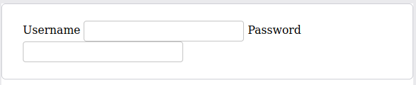

***LEGEND***

Legenda providencia um cabeçalho ou descrição para o elemento <fieldset\>.

```html
<fieldset>
  <legend>Login</legend>
  <label>
    Username
    <input type="text" name="username">
  </label>
  <label>
    Password
    <input type="text" name="password">
  </label>
</fieldset> 
```


### FORM & INPUT ATTRIBUTES

***DISABLED***

Atributo de tipo boleano que desativa um elemento de formulário, para que não seja possível a interação do usuário com ele, sendo impossível enviar inputs.

OBS: Aplicando o boleano *disabled* para todo um fieldset vai desabilitar todos campos dentro deste fieldset.

***PLACEHOLDER***

O atributo placeholder funciona como uma dica ao usuário do que deverá ser inserido naquele campo, indicando um exemplo de texto ou valor a ser inserido, que desaparece quando o usuário começa a interação de preencher o campo.

```html
<label>
  Email Address
  <input type="email" name="email-address" placeholder="name@domain.com">
</label>
```

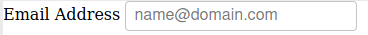

***REQUIRED***

Atributo do tipo boleano que enforça que o elemento do formulário deve ser preenchido, sendo necessário preencher ele com algum valor antes da submissão.

Caso não seja preenchido, sera enviado uma mensagem de erro para o usuário, requisitando-o.

```html
<label>
  Email Address
  <input type="email" name="email-address" required>
</label>
```

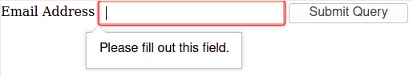

***ATRIBUTOS ADICIONAIS***

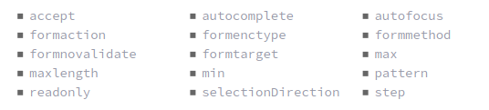