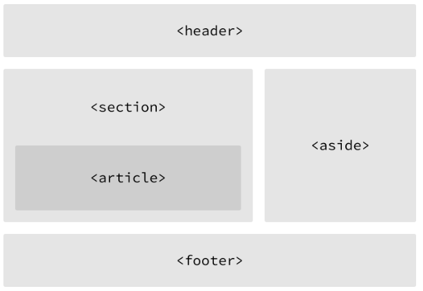

# HTML

HTML significa HyperText Markup Language → Não é uma linguagem de programação, mas sim uma linguagem de marcação, utilizada para que navegadores (chrome, firefox, Explorer, opera) interpretem suas marcações e transforme na página que será visualizada.

### DOM → Document Object Model

Basicamente a estruturação de documentos Web (o padrão de formato). 

Estruturado em 3 partes principais: Doctype, Head, Body

### TERMOS COMUNS EM HTML

- ELEMENTS

Designações. Definem a estrutura e o conteúdo em uma página.

Identificados entre "<" e ">"

Exemplo: <a\>

- TAGS

A utilização dos símbolos "<" e ">" ao redor do elemento criam a tag.

As tags mais comuns são abertas e fechadas em pares.

```html
<div>
Temos acima a abertura da tag div (divisão) e abaixo o fechamento da tag.
</div>
```

- ATRIBUTOS

Propriedades que providenciam maiores informações acerca do elemento.

```html
<a href="http://sitequalquer.com">Clique aqui para acessar um site qualquer</a>
	 |-----> atributo da tag 'a' (âncora)
```

## ESTRUTURAÇÃO DO HTML

```html
<!DOCTYPE html>
<html lang="pt-br">
	<head>
		<meta charset="UTF-8">
		<title> Hello, World!</title>
	</head>
	<body>
		<h1> Hello, my World!</h1>
		<p>Isso vai aparecer no site.</p>
	</body>
</html>
```

## SEMÂNTICA

Prática de fornecer conteúdo, sentido e estrutura, utilizando o elementos ideais para cada caso.

Desconsidera questões visuais, avaliando a estrutura semântica da página por meio de seus elementos.

## ARQUITETURA DE UM HTML



Outro elemento importante é o nav:

```html
<nav>
Utilizado aqui para navegar entre as informações do site, do servidor, etc.
</nav>
```