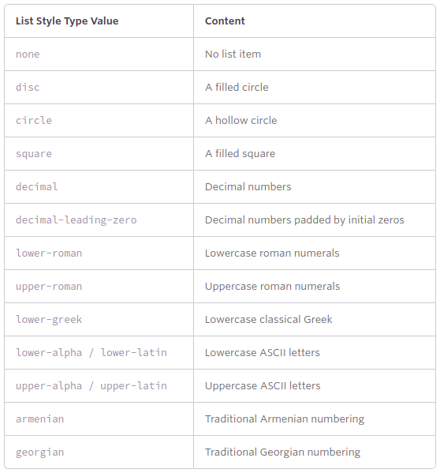

# LISTAS

### **UNORDERED LISTS**

Listas de itens cuja a ordem não é importante.

```html
<ul>
  <li>Orange</li>
  <li>Green</li>
  <li>Blue</li>
</ul>
```

### ORDERED LISTS

Listas cuja ordem é relevante.

```html
<ol>
  <li>Head north on N Halsted St</li>
  <li>Turn right on W Diversey Pkwy</li>
  <li>Turn left on N Orchard St</li>
</ol>
```

Listas ordenadas possuim atributos únicos: *start* e *reversed*

- Start attribute

O atributo start define de qual valor a lista ordenada irá começar.

Aceita apenas valores inteiros.

```html
<ol start="30">
  <li>Head north on N Halsted St</li>
  <li>Turn right on W Diversey Pkwy</li>
  <li>Turn left on N Orchard St</li>
</ol>
```

- Reversed attribute

Permite a lista aparecer em uma ordem reversa.

```html
<ol reversed>
  <li>Head north on N Halsted St</li>
  <li>Turn right on W Diversey Pkwy</li>
  <li>Turn left on N Orchard St</li>
</ol>
```

- Value attribute

Pode ser utilizado em um específico elemento <li> em uma lista ordenada para determinar o valor dentro desta lista. Será recalculado o valor dos próximos elementos.

```html
<ol>
  <li>Head north on N Halsted St</li>
  <li value="9">Turn right on W Diversey Pkwy</li>
  <li>Turn left on N Orchard St</li>
</ol>
```

### DESCRIPTION LISTS

Outro tipo de listas existente em HTML são as chamadas description lists.

Elas são utilizadas, normalmente, para criar descrição de um elemento, por exemplo, em um glossário.

< dl >  : criação da description list

< dt > : termo de descrição

< dd > : elemento ou dado descritivo 

```html
<dl>
  <dt>study</dt>
  <dd>The devotion of time and attention to acquiring knowledge on an academic subject, especially by means of books</dd>
  <dt>design</dt>
  <dd>A plan or drawing produced to show the look and function or workings of a building, garment, or other object before it is built or made</dd>
  <dd>Purpose, planning, or intention that exists or is thought to exist behind an action, fact, or material object</dd>
  <dt>business</dt>
  <dt>work</dt>
  <dd>A person's regular occupation, profession, or trade</dd>
</dl>
```

### ANINHANDO LISTAS

É possível aninhar listas, agrupando uma lista dentro de outra, sem ser, necessariamente, todas ordenadas, não ordenadas ou descritivas.

```html
<ol>
  <li>Walk the dog</li>
  <li>Fold laundry</li>
  <li>
    Go to the grocery and buy:
    <ul>
      <li>Milk</li>
      <li>Bread</li>
      <li>Cheese</li>
    </ul>
  </li>
  <li>Mow the lawn</li>
  <li>Make dinner</li>
</ol>
```

### LIST ITEM STYLING

Por padrão, temos em listar ordenadas em não ordenadas alguns marcadores, que podem ser alterados por meio de código CSS.

Para isso, utilizamos a propriedade *list-style-type* para configurar o conteúdo do marcador.

OBS: podemos colocar como marcador de uma lista não ordenada, números romanos e quadrados em listas ordenadas.

```css
ul {
  list-style-type: square;
}
```

- *LIST STYLE TYPE VALUES*



### UTILIZANDO IMAGENS COMO MARCADORES

Para colocar uma imagem como o marcador de uma lista, qualquer que seja ela, utilizamos a seguinte estratégia: retiramos o estilo de marcador de lista por meio do valor 'none' e acrescentamos o background de cada elemento da lista, da tag li, com a imagem desejada.

```html
<ul>
  <li>Orange</li>
  <li>Green</li>
  <li>Blue</li>
</ul>
```

```css
li {
  background: url("arrow.png") 0 50% no-repeat;
  list-style-type: none;
  padding-left: 12px;
}
```

### LIST STYLE POSITION PROPERTY

Por padrão, os itens marcadores estão situados a esquerda (outside) do conteúdo do elemento da lista e todo seu conteudo será a direita, impossibilitando a passagem do conteúdo abaixo do marcador.

Utilizando a propriedade *list-style-position* com os valores possíveis: outside to inside or inherit, podemos então configurar a nossa escolha.

```css
ul {
  list-style-position: inside;
}
# * cupcakes - One of the best desserts known to ever 
# exist, especially when toppen with cream cheese
# * Sprinkles – One of the most popular toppings for 
# cupcakes, adding that extra bit of decoration and sugar
```

### HORIZONTALLY DISPLAYING LIST

Ocasionalmente queremos colocar listas horizontais, por exemplo quando construimos menus de navegação entre páginas do próprio site.

Para isso, configuramos os elementos li para terem propriedades de display com valor de inline-block ou inline ou então utilizando float.

- DISPLAYING LIST

O método mais simples é colocar a propriedade *display* com valor de inline ou inline-block, o que coloca todos os elementos < li > em uma única linha, com espaços entre eles.

Quando alteramos a propriedade de display de um elemento li, retiramos a marcação, seja ela qual for.

```css
li {
  display: inline-block;
  margin: 0 10px;
}
```

- FLOATING LIST

Acrescentar a propriedade *float* com valor desejado é utilizada quando se deseja manter a marcação dos elementos da lista.

Settando a propriedade float para à esquerda de todos os elementos li, teremos uma única linha horizontal com todos elementos, sem espaço um entre o outro.

Para previnir que um marcador fique acima de um elemento li, utilizamos a margem para ajeitar esta falha.

```css
li {
  float: left;
  margin: 0 20px;
}
```

### NAVIGATIONAL LIST EXAMPLE

Exemplo muito comum, o de navegação entre específicos sites ou ambientes da mesma página.

HTML

```html
<nav class="navigation">
  <ul>
    <li><a href="#">Profile</a></li><!--
    --><li><a href="#">Settings</a></li><!--
    --><li><a href="#">Notifications</a></li><!--
    --><li><a href="#">Logout</a></li>
  </ul>
</nav>
```

CSS

```css
.navigation ul {
  font: bold 11px "Helvetica Neue", Helvetica, Arial, sans-serif;
  margin: 0;
  padding: 0;
  text-transform: uppercase;
}
.navigation li {
  display: inline-block;
}
.navigation a {
  background: #395870;
  background: linear-gradient(#49708f, #293f50);
  border-right: 1px solid rgba(0, 0, 0, .3);
  color: #fff;
  padding: 12px 20px;
  text-decoration: none;
}
.navigation a:hover {
  background: #314b60;
  box-shadow: inset 0 0 10px 1px rgba(0, 0, 0, .3);
}
.navigation li:first-child a {
  border-radius: 4px 0 0 4px;
}
.navigation li:last-child a {
  border-right: 0;
  border-radius: 0 4px 4px 0;
}
```