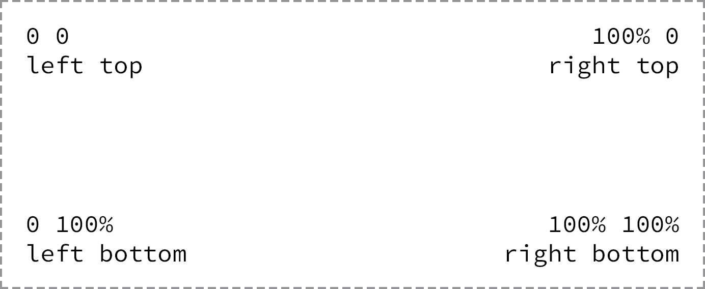

# SETTING BACKGROUNDS  & GRADIENTS

```css
div {
  background: #466368;
  background: radial-gradient(#648880, #293f50);
}

```

### ADICIONANDO UMA COR DE FUNDO

As with other color values, we can pick from keywords, hexadecimal codes, and RGB, RGBa, HSL, and HSLa values.

```css
div {
	background-color: #b2b2b2;
}
```

### ADICIONANDO UMA IMAGEM DE FUNDO

```css
div {
  background-image: url("alert.png");
}
```

Utilizando somente este trecho, podemos obter resultados inesperados, uma vez que por padrão, a imagem é repetida verticalmente e horizontalmente, preenchendo o elemento que possuia-a como propriedade.

Podemos adicionar então:

```css
div {
  background-image: url("alert.png");
  background-repeat: no-repeat;
}
```

A propriedade background-repeat pode receber 4 valores: repeat, repeat-x, repeat-y, and no-repeat.

### POSICIONANDO

Podemos ainda posicionar a imagem de forma mais agradável.

Por padrão, a imagem vem posicionada no canto superior esquerdo do elemento.

```css
div {
  background-image: url("alert.png");
  background-position: 20px 10px;
  background-repeat: no-repeat;
}
```



Background images são posicionadas no canto superior esquerdo do objeto.

## DESIGNING GRADIENT BACKGROUNDS

> [http://meyerweb.com/eric/thoughts/2012/04/26/lineargradient-keywords/](http://meyerweb.com/eric/thoughts/2012/04/26/lineargradient-keywords/)

Para utilizar um gradiente, basta acrescentarmos o código:

```css
div {
  background: linear-gradient(#648880, #293f50);
}
```

Gradientes lineares são identificados utilizando a função *linear-gradient( )* na propriedade background ou background-image.

Gradientes lineares devem receber dois parâmetros, o primeiro deve ser a cor inicial e o segundo deve ser a cor final.

OBS: normalmente, colocamos um background padrão para casos em que o navegador não suporte o linear-gradient( ).

### ALTERANDO A DIREÇÃO DO GRADIENTE

Por padrão, lienar gradient background movem do topo para baixo de um elemento.

Podemos alterar esta direção a partir de palavras chave ou por meio de valores angulares passados antes dos valores das cores.

```css
div {
  background: #466368;
  background: linear-gradient(to right bottom, #648880, #293f50);
}
```

### GRADIENTE RADIAL

O gradiente radial funciona de dentro para fora

```css
div {
  background: #466368;
  background: radial-gradient(#648880, #293f50);
}
```

### GRADIENT COLOR STOPS

Podemos colocar mais colorações para realizar a transição de gradiente, acrescentando virgulas entre todas as transações.

```css
div {
  background: #648880;
  background: linear-gradient(to right, #f6f1d3, #648880, #293f50);
}
```

Podemos ainda tomar controle da posição em que começa e termina a transição de uma coloração para outra.

```css
div {
  background: #648880;
  background: linear-gradient(to right, #f6f1d3, #648880 85%, #293f50);
}
```

### MULTIPLE BACKGROUND IMAGES

Separando por vírgulas, podemos colocar mais de um background como valor nas propriedades de background e background-image.

```css
div {
  background:  url("foreground.png") 0 0 no-repeat, url("middle-ground.png") 0 0 no-repeat, url("background.png") 0 0 no-repeat;
}
```

### OUTRAS PROPRIEDADES

A propriedade *background-size* permite alterar o tamanho da imagem de fundo.

*background-clip* e *background-origin* permite ocntrolar onde a imagem de fundo é recortada e onde ela estará contida dentro do elemento (dentro da borda ou dentro do padding).

```css
div {
  background: url("shay.jpg") 0 0 no-repeat;
  background-size: auto 75%;
  border: 2px dashed #9799a7;
  height: 240px;
  width: 200px;
}
```

```css
div {
  background: url("shay.jpg") 0 0 no-repeat;
  background-clip: padding-box;
  background-origin: border-box;
}
```